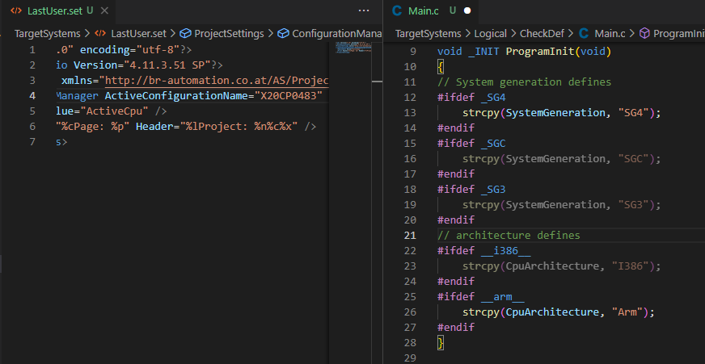

# Change Log

All notable changes to the "vscode-brautomationtools" extension will be documented in this file.

The format is based on [Keep a Changelog](https://keepachangelog.com/en/1.0.0/),
and this project adheres to [Semantic Versioning](https://semver.org/spec/v2.0.0.html).

## [Unreleased]
Add new but unreleased features, fixes... here during development

Users can look forward to these changes for the next release 😀😉

### Added
- Added a command to change the active PLC configuration. Until now this was only possible by manually adjusting the LastUser.set file in the project root. [#1](https://github.com/br-automation-com/vscode-brautomationtools/issues/1) 
  More information can be found in the [readme file](./README.md#detecting-and-changing-the-active-configuration) 
  This finally closes the very first official issue in the repository 😎.
- Added contents to the readme section for commands

### Changed
- Changed internal XML backend from `xmlbuilder2` to `fast-xml-parser`. This change will allow us to easier parse and also modify XML files for new features.
- Improved AS V3.x configuration view package files support. We still (and maybe will never) not support all settings and files.

### Fixed
- The default connection port in the ArSim transfer task was adjusted.
  [#39](https://github.com/br-automation-com/vscode-brautomationtools/issues/39) 
  Existing configurations defined in the tasks.json file are not affected by the template change and need to be adjusted manually.

## [0.0.7] - 2023-01-03

🎉 Happy new year! 🎉

The major rework in [#5](https://github.com/br-automation-com/vscode-brautomationtools/issues/5) was done and I finally found the time to release the next version.

### Added
- Many new logger information, warning and error messages due to the new architecture.
  [#12](https://github.com/br-automation-com/vscode-brautomationtools/issues/12)
- There is a new option `Detail` for the log level `vscode-brautomationtools.logging.logLevel` which shows more detailed information of executed processes, but without debugging information. The level can be set by users which are interested on what actions are done under the hood of the extension.
- The PLC family type of the active configuration is now considered for selecting the correct gcc compiler for the CPU architecture and system generation. This leads to a proper highlighting of e.g. `#ifdef _SG4` or `#ifdef __i386__` in the source code.
  [#11](https://github.com/br-automation-com/vscode-brautomationtools/issues/11)
  
- The logger output is now automatically shown for all log entries with level `Warning` or higher. With this change you get to know issues more actively. The behaviour can be changed with the new setting `vscode-brautomationtools.logging.showOutputOnImportantMessage`

### Changed
- Reworked most of the underlying code architecture. The functionality should be same, but this will make us more flexible for new features and bug fixes. If you find some functionality which does not work anymore, please [create an issue](https://github.com/br-automation-com/vscode-brautomationtools/issues).
  [#5](https://github.com/br-automation-com/vscode-brautomationtools/issues/5)

### Fixed
- The pattern to parse the build output for problems was broken due to the timestamp which was added in [#31](https://github.com/br-automation-com/vscode-brautomationtools/issues/31). The pattern was fixed to work with and without timestamps in different locales.
  [#41](https://github.com/br-automation-com/vscode-brautomationtools/issues/41)

## [0.0.6] - 2022-01-17
This release adds some small usability features.

### Added
- The build of an Automation Studio project now shows timestamps and the total duration of the build
  [#31](https://github.com/br-automation-com/vscode-brautomationtools/issues/31)
- A new notification is shown, if a setting which requires a reload was changed. A reload can be triggered directly in the notification.
  [#18](https://github.com/br-automation-com/vscode-brautomationtools/issues/18)
- A StatusBar item was added which shows that the extension is currently busy. When hovering it with the mouse, a tooltip shows which tasks are currently executed.
  At the moment it is only shown during activation of the extension, but in the future other events, such as running builds etc. may be added.
  [#6](https://github.com/br-automation-com/vscode-brautomationtools/issues/6)

## [0.0.5] - 2022-01-16
This release fixes some bugs which prevented IntelliSense to work. There are also new notification and logging settings.

### Added
- A new notification is shown after an update of the extension. By clicking the `Show changes` button you will be redirected to the changelog on GitHub. 
  If you don't like the notification you can click the `Don't show again after update` button and we will not bother you anymore. 
  The setting to hide the notification can also be set in the settings menu under `vscode-brautomationtools.notifications.hideNewVersionMessage`
  [#26](https://github.com/br-automation-com/vscode-brautomationtools/issues/26)
- The activation notification message can now be hidden by clicking the `Don't show on activation` button or in the settings under `vscode-brautomationtools.notifications.hideActivationMessage`
- The additional data added by some logger entries can now be pretty printed by setting the new configuration value `vscode-brautomationtools.logging.prettyPrintAdditionalData` to `true`. This can make it easier to analyze the data but the log output will use multiple lines for one entry.

### Fixed
- Multiple build options were not provided to the C/C++ extension in the correct way. Therefore IntelliSense was not working when multiple build options were set.
  [#27](https://github.com/br-automation-com/vscode-brautomationtools/issues/27)
- Providing data to the C/C++ extension was too slow, which lead to unhandled exceptions in the C/C++ extension runtime status.
  IntelliSense was still working as soon as our extension finished activation.
  With this version our extension will directly provided the first data to the C/C++ extension and update the data after new information is available.
  [#29](https://github.com/br-automation-com/vscode-brautomationtools/issues/29)

### Changed
- The default setting for the log level `vscode-brautomationtools.logging.logLevel` was changed from `Debug` to `Info`.
  This was done to prevent too many log entries for normal users.

## [0.0.4] - 2021-12-04
This release brings a more robust IntelliSense functionality when some files or file contents are missing in the AS project.
Also the support for C++ and modern C features was enhanced.

### Fixed
- The active configuration was not set, when no LastUser.set file was in the AS project root
  This lead to a not working IntelliSense functionality
  [#24](https://github.com/br-automation-com/vscode-brautomationtools/issues/24)
- Show only warnings and do not fail whole Cpu.pkg parsing functionality when there was no Module ID or AR Version found
  [#23](https://github.com/br-automation-com/vscode-brautomationtools/issues/23)
- The C-Standard was hard coded to gnu-99 which prevented modern C and C++ features to work. The assignment was removed, as newer versions of the C/C++
  extension support automatic querying from the compiler
  [#10](https://github.com/br-automation-com/vscode-brautomationtools/issues/10)
- The default compiler argument `-ansi` lead to an error on vector initilization, e.g. `std::vector<int> v = {1, 2, 42}` (std::initializer_list).
  This argument was removed.
  [#21](https://github.com/br-automation-com/vscode-brautomationtools/issues/21)
  Further investigation of the arguments will be done in [#25](https://github.com/br-automation-com/vscode-brautomationtools/issues/25)

## [0.0.3] - 2021-11-30
This release adds support for Automation Studio Versions >= V4.9.x and new tasks to transfer to a PLC.

### Added
- Reading of the active configuration from the LastUser.set file
  Required for configuration dependent features
- Provide settings of additional includes and build defines to the C/C++ extension
  - Provide include directories defined in the Cpu.pkg file to the C/C++ extension
  - Provide compiler switches (e.g. -D defines) defined in the Cpu.pkg file to the C/C++ extension
- Improved logging and notifications
  - New setting logging.logLevel
- Support for Automation Studio Versions >= V4.9.x
- Provide tasks to transfer the Automation Studio project using PVITransfer.exe
  - New setting `vscode-brautomationtools.environment.pviInstallPaths` to find PVITransfer.exe

### Fixed
- No output was generated for build and transfer tasks anymore

### Changed
- The structure of the readme file was changed and new features are documented
- The extension is now published in a bundled form, which reduces the load time
- Parsing of folder names to AS version due to support for AS V4.10.x

  The folder name in the installation directory for AS V4.10 is AS410.
  Until now this would be parsed as V4.1.0. From this version on it will be parsed as V4.10.

  This change leads to the restriction, that older pre-release AS versions cannot be used anymore. AS V4.3.3 pre-release e.g. was stored in the folder AS433 which will now be parsed as AS V4.33 instead of AS V4.3.3.

## [0.0.2] - 2020-06-19
This release contains only documentation changes.

### Added
- Description of features, settings...

## [0.0.1] - 2020-06-18
This is the first released version of the vscode-brautomationtools extension.

### Added
- Build B&R Automation Studio projects
- Show errors and warnings of Automation Studio build
- Basic auto completion for C/C++ programs and libraries
- Detecting installed B&R Automation Studio versions
- Detecting B&R Automation Studio projects in the workspace folders