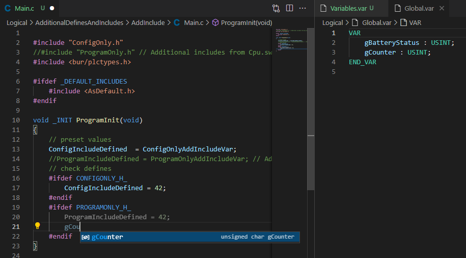
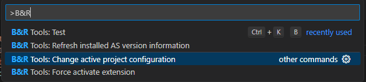
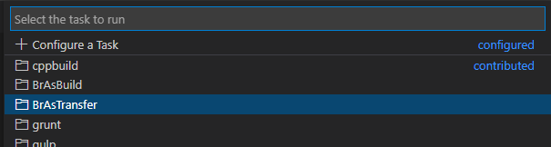
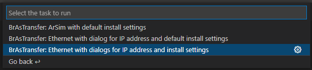
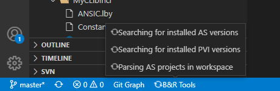
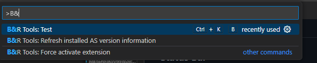
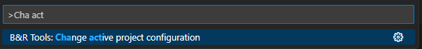

# B&R Automation Tools

B&R Automation Tools is an extension for [_Visual Studio Code_](https://code.visualstudio.com) to program and build B&R Automation Studio projects.

The B&R Automation Tools extension is NOT a product of [_B&R Industrial Automation GmbH_](https://www.br-automation.com), it is a privately written and inofficial experiment. Therefore B&R Industrial Automation GmbH does not offer any support for this extension.

For any bugs or feature requests please open a [_Github issue_](https://github.com/br-automation-com/vscode-brautomationtools/issues).

## Scope

This extension does not intend to replace Automation Studio as the main IDE for B&R PLC projects. The main goal is to offer a good code editing experience for B&R projects within VS Code. The current development focus lays on C/C++ programs and libraries.

B&R ressources such as executuable binaries etc. are not provided by this extension. Features which require such ressources are only available if the ressources are installed on your system.

## Readme contents

- [How to run the extension](#how-to-run-the-extension)
- [Features](#features)
  - [Auto completion / linting of C/C++ programs and libraries](#auto-completion-for-cc-programs-and-libraries)
  - [Detecting B&R Automation Studio projects in the workspace folders](#detecting-br-automation-studio-projects-in-the-workspace-folders)
  - [Detecting the active configuration](#detecting-and-changing-the-active-configuration)
  - [Build B&R Automation Studio projects](#build-br-automation-studio-projects)
  - [Show errors and warnings of Automation Studio build in source code](#show-errors-and-warnings-of-automation-studio-build-in-source-code)
  - [Detecting installed B&R Automation Studio versions](#detecting-installed-br-automation-studio-versions)
  - [Transfer the project to a PLC or ArSim](#transfer-the-project-to-a-plc-or-arsim)
  - [Detecting installed B&R PVI versions](#detecting-installed-br-pvi-versions)
- [Logging](#logging)
- [UI Elements](#ui-elements)
- [Commands](#commands)
- [Settings](#settings)
- [Requirements](#requirements)
- [Known issues](#known-issues)


## How to run the extension

### For non developers

#### From VS Code marketplace

You can download the extension in the [_VS Code marketplace_](https://marketplace.visualstudio.com/items?itemName=radeonmann.vscode-brautomationtools).

#### From VSIX installer

1. Download a VSIX from one of the [_releases_](https://github.com/br-automation-com/vscode-brAutomationTools/releases)
2. [_Install the extension from the VSIX file_](https://code.visualstudio.com/docs/editor/extension-gallery#_install-from-a-vsix)
   
   

   > Do not double click the VSIX file, as it will try to install the extension to the full Visual Studio IDE.

If you don't want to test the extension in your productive VS Code environment, consider to have a separate [_portable VS Code instance_](https://code.visualstudio.com/docs/editor/portable).

### For developers / To test the most recent source changes

You will need [_node.js_](https://nodejs.org/en/) installed on your computer

1. Clone the repository from https://github.com/br-automation-com/vscode-brautomationtools.git
2. Open the cloned repository in VS Code
3. Run `npm install` in the terminal to get all required node.js modules
4. Build the xtension
   1. Press `F5` to run the extension in the development host
   2. Or run the `Create VSIX package` task to build an extension installer

## Features

### Auto completion for C/C++ programs and libraries

The B&R Automation Tools extension provides information to the [_C/C++ extension_](https://marketplace.visualstudio.com/items?itemName=ms-vscode.cpptools) specific to an Automation Studio project.

This enables to use IntelliSense within C/C++ programs and libraries of Automation Studio projects. IntelliSense is also provided for variables, types, functions and function blocks within IEC files (*.var, *.typ, *.fun). Additional includes and compiler defines configured in the Automation Studio project are also included in the IntelliSense information.



Currently the extension uses the header files created during an Automation Studio build to provide this information. Therefore after adjusting any of the IEC files, you need to build your project to get proper IntelliSense. A build of the cross reference is sufficient to create the header files. See [Build B&R Automation Studio projects](#build-br-automation-studio-projects) for further information.

### Detecting B&R Automation Studio projects in the workspace folders

All Automation Studio projects within all opened workspace folders are detected by the B&R Automation Tools extension. This information is used to provide information for other features, such as build, code completion...

When adding or removing a folder to the workspace, the information is automatically updated by the extension.

### Detecting and changing the active configuration

Some settings like e.g. additional includes are PLC configuration specific. The active configuration is evaluated from the LastUser.set file in the root of your AS project.
If no LastUser.set file is found in your project root, the first configuration is selected as the active configuration.

The active configuration can be changed in two ways:
- By calling the command from the command pallette `Ctrl + Shift + P`<br/>
  
- By modifying the LastUser.set file in the project root. Automation Studio modifes this file when changing the configuration in the Configuration View, so a a change within AS is automatically detected by the extension.<br/>

### Build B&R Automation Studio projects

> Build functionality is only available, if an Automation Studio installation with a version matching the project version was detected by the B&R Automation Tools extension. See [Detecting installed B&R Automation Studio versions](#detecting-installed-br-automation-studio-versions).

The B&R Automation Tools extension provides tasks which execute BR.AS.Build.exe. This makes it possible to build the project directly within VS Code. The tasks can be configured for a normal build, a build for a simulation target, creating an RUC package, cleaning the configuration and building the cross reference.

You can start the tasks by executing the `Run Task...` command in the `Terminal` Menu. If you want to configure the task as a standard build task, you can also select `Run Build Task...`.


VS Code will then show a list with all possible task providers. Select `BrAsBuild` to get a list of all standard tasks for BR.AS.Build.exe.


The B&R Automation Tools extension will then provide a list of all standard tasks. Select one to directly execute it, or click the gear icon on the right side to configure it in your workspace.


Configured tasks will be added to the _tasks.json_ in the _.vscode_ folder at the root of your workspace. There you can configure further options for your tasks, like e.g. the used build mode. VS Code will provide auto completion and descriptions for all available options.

#### Examples

A configured _tasks.json_ file could look like this:

```json
{
    "version": "2.0.0",
    "tasks": [
        {
            "label": "Build AS project with dialogs",
            "type": "BrAsBuild",
            "group": {
                "kind": "build",
                "isDefault": true
            }
        },
        {
            "label": "Rebuild AS project with RUC package",
            "type": "BrAsBuild",
            "asBuildMode": "Rebuild",
            "buildRUCPackage": true,
            "group": "build"
        },
        {
            "label": "Clean AS project",
            "type": "BrAsBuild",
            "cleanTemporary": true,
            "cleanBinary": true,
            "cleanGenerated": true,
            "cleanDiagnosis": false
        },
        {
            "label": "Build cross references of AS project",
            "type": "BrAsBuild",
            "buildCrossReferences": true
        }
    ]
}
```

>Tip: You don't have to enter unused options. Some options will show a dialog on execution of the task if they are not set (e.g. the build mode).

Check out the [_VS Code documentation_](https://code.visualstudio.com/docs/editor/tasks) for further information about tasks.

### Show errors and warnings of Automation Studio build in source code

The B&R Automation Tools extension shows the error and warning output of a build task. The errors and warnings will show up in the Problems window, in the workspace browser and in the editor of the file where the issue was detected.


### Detecting installed B&R Automation Studio versions

B&R Automation Tools finds Automation Studio versions installed on the developer PC. The information of the installed Automation Studio versions is used to provide information for other features, such as build, code completion...

The directory in which the Automation Studio versions are searched must be configured with the setting `vscode-brautomationtools.environment.automationStudioInstallPaths`. The default value is ```["C:\BrAutomation"]```.

The setting needs to have the same value(s) as the install path selected during Automation Studio installation. No recursive search is done.

After changing the installation path setting, the installed versions can be refreshed via the _B&R Tools: Refresh installed AS version information_ (`vscode-brautomationtools.updateAvailableAutomationStudioVersions`) command from the [_Command Palette_](https://code.visualstudio.com/docs/getstarted/userinterface#_command-palette), or by refreshing VS Code.

#### Example

If Automation Studio V4.6.x and V4.7.x are installed in `C:\BrAutomation` the directory structure looks like this:

```
|- C:\BrAutomation
|   |- AS
|   |- AS46
|   |   |- AS
|   |   |- Bin-en
|   |   |- ...
|   |- AS47
|   |   |- AS
|   |   |- Bin-en
|   |   |- ...
|   |- ...
```

For this case the setting `vscode-brautomationtools.environment.automationStudioInstallPaths` needs to be set to ```["C:\BrAutomation"]```.

### Transfer the project to a PLC or ArSim

> Transfer functionality is only available, if a PVI installation with a version matching the project version was detected by the B&R Automation Tools extension. See [Detecting installed B&R PVI versions](#detecting-installed-br-pvi-versions).

The B&R Automation Tools extension provides tasks which execute PVITransfer.exe. This makes it possible to transfer a project to a PLC or ArSim directly from VS Code. The tasks can be configured with various transfer settings which are usually available in the Runtime Utility Center or Automation Studio.

You can start the tasks by executing the `Run Task...` command in the `Terminal` Menu.


VS Code will then show a list with all possible task providers. Select `BrAsTransfer` to get a list of all standard tasks for PVITransfer.exe.



The B&R Automation Tools extension will then provide a list of all standard tasks. Select one to directly execute it, or click the gear icon on the right side to configure it in your workspace.



Configured tasks will be added to the _tasks.json_ in the _.vscode_ folder at the root of your workspace. There you can configure further options for your tasks, like e.g. the used transfer mode. VS Code will provide auto completion and descriptions for all available options.

> It is important to note, that the transfer task does not automatically trigger a project build. The transfer task will use the RUC package generated by a former build of the same configuration. Therefore a build with the option `"buildRUCPackage": true` needs to be executed before each transfer. VS Code offers an option for task dependencies, which can be used to automatically execute a build before the transfer. If you use the dialog to select the configuration for build and transfer, this dialog will show up two times.

#### Examples

A configured _tasks.json_ file could look like this:

```json
{
	"version": "2.0.0",
	"tasks": [
        {
            "label": "Build with RUC package",
            "type": "BrAsBuild",
            "group": "build",
            "buildRUCPackage": true
        },
		{
			"label": "BrAsTransfer: ArSim with default install settings",
			"type": "BrAsTransfer",
			"pviConnectionSettings": {
				"deviceInterface": "tcpip",
				"sourceNode": 42,
				"destinationAddress": "127.0.0.1",
				"destinationPort": 11169,
				"communicationTimeout": 1000,
				"connectionEstablishedTimeout": 60
			},
			"installationSettings": {
				"installMode": "Consistent",
				"installRestriction": "AllowInitialInstallation",
				"keepPVValues": false,
				"executeInitExit": true,
				"tryToBootInRUNMode": false
			},
			"problemMatcher": [
				"$BrAsBuild"
			],
            "dependsOn": ["Build with RUC package"]
		},
		{
			"label": "BrAsTransfer: Ethernet with dialog for IP address and default install settings",
			"type": "BrAsTransfer",
			"pviConnectionSettings": {
				"deviceInterface": "tcpip",
				"sourceNode": 42,
				"destinationPort": 11169,
				"communicationTimeout": 1000,
				"connectionEstablishedTimeout": 60
			},
			"installationSettings": {
				"installMode": "Consistent",
				"installRestriction": "AllowInitialInstallation",
				"keepPVValues": false,
				"executeInitExit": true,
				"tryToBootInRUNMode": false
			},
			"problemMatcher": [
				"$BrAsBuild"
			],
            "dependsOn": ["Build with RUC package"]
		}
	]
}
```

>Tip: You don't have to enter unused options. Some options will show a dialog on execution of the task if they are not set (e.g. the install mode or the PLC address).

Check out the [_VS Code documentation_](https://code.visualstudio.com/docs/editor/tasks) for further information about tasks.

### Detecting installed B&R PVI versions

B&R Automation Tools finds PVI versions installed on the developer PC. The information of the installed PVI versions is used to provide information for other features, such as the transfer of projects to a PLC or ArSim.

The directory in which the PVI versions are searched must be configured with the setting `vscode-brautomationtools.environment.pviInstallPaths`. The default value is ```["C:\BrAutomation\PVI"]```.

After changing the setting, a reload of the VS Code window is required.

#### Example

If PVI V4.6.x and V4.9.x are installed in `C:\BrAutomation\PVI` the directory structure looks like this:

```
|- C:\BrAutomation\PVI
|   |- V4.6
|   |   |- As
|   |   |- Bin
|   |   |- ...
|   |- V4.9
|   |   |- As
|   |   |- Bin
|   |   |- ...
|   |- ...
```

For this case the setting `vscode-brautomationtools.environment.pviInstallPaths` needs to be set to ```["C:\BrAutomation\PVI"]```.

## Logging

The extension logs information, warnings and errors which occur to the output window. This can help you as a user to see if something
went wrong and is also important information for us developers to find bugs.

You can see all messages in the output window, when you select the `vscode-brautomationtools` channel.


Some of the log entries contain additional data in JSON format. With the default settings, this data is printed at the end of the same line.
This data can be pretty printed which makes it easier to analyze by setting `logging.prettyPrintAdditionalData` to `true`. However, this will
make the output more verbose, as multiple lines will be used for the additional data.

```
logging.prettyPrintAdditionalData = false;

[09:04:22.627 - debug] SomeModule.someFunction(a, b) {"a":42,"b":"greeting","return":{"x":"Hello","y":"world"}}
```

```
logging.prettyPrintAdditionalData = true;

[09:00:55.038 - debug] SomeModule.someFunction(a, b)
{
  "a": 42,
  "b": "greeting",
  "return": {
    "x": "Hello",
    "y": "world"
  }
}
```

## UI Elements

### Status Bar

#### Busy indicator

The busy indicator in the status bar is shown whenever the extension is busy with a longer running task such as parsing the Automation Studio projects in the workspace. When hovering the indicator with the mouse pointer, a tooltip shows which tasks are currently executing.



At the moment this indicator is only shown during extension activation.

## Commands

### The VS Code command prompt

With the key combination `Ctrl + Shift + P`, VS Code shows all available commands. In the prompt you can the write text and VS Code will search for commands. Our commands from this extension are all prefixed with B&R Tools, so you can easily find all commands by just typing B&R in the command search input.



The search is quite smart, so you don't have to know the start of the command name. Some text from within the name is sufficient.



### Commands provided by the extension

TODO List of commands with descriptions.

## Settings

| Name                                                                | Description  |
|---------------------------------------------------------------------|--------------|
| `vscode-brautomationtools.build.defaultBuildMode`                   | Default build mode which will be pre-selected in build task dialogs. |
| `vscode-brautomationtools.environment.automationStudioInstallPaths` | Paths where the Automation Studio versions are installed. E.g. if Automation Studio V4.6.x is installed in C:\\BrAutomation\\AS46, the install path is C:\\BrAutomation. See [Detecting installed B&R Automation Studio versions](#detecting-installed-br-automation-studio-versions) |
| `vscode-brautomationtools.environment.pviInstallPaths`              | Paths where the PVI system is installed. See [Detecting installed B&R PVI versions](#detecting-installed-br-pvi-versions) |
| `vscode-brautomationtools.logging.logLevel`                         | The level for the log output. See [Logging](#logging) |
| `vscode-brautomationtools.logging.showOutputOnImportantMessage`     | If activated, the log output will be automatically shown on messages of level Warning or higher. See [Logging](#logging) |
| `vscode-brautomationtools.logging.prettyPrintAdditionalData`        | Pretty print additional data in logger. This means, that the additional JSON data will be spread over mutliple lines and indented. See [Logging](#logging) |
| `vscode-brautomationtools.notifications.hideActivationMessage`      | If set to true, no notification is shown after the extension finished the activation |
| `vscode-brautomationtools.notifications.hideNewVersionMessage`      | If set to true, no notification is shown after a new version was installed |


## Requirements

The B&R Automation Tools extension requires the [_C/C++ extension_](https://marketplace.visualstudio.com/items?itemName=ms-vscode.cpptools) for auto completion. It will be automatically installed during installation of the B&R Automation Tools extension.

## Known Issues

### Transfer task workflow

The transfer task workflow is currently prompting multiple times for the configuration. Also there is no detection, if a build of the configuration to transfer was executed recently. It would be possible to improve this workflow. If you would like to see improvements on this, please write a comment on the [_GitHub Issue_](https://github.com/br-automation-com/vscode-brautomationtools/issues/19)

### Support for IEC languages

The B&R Automation Tools extension currently does not support auto completion or syntax highlighting for IEC language files. Some extensions for IEC languages are already existing and you can use them in combination with this extension.

One examples is the [_Structured Text language Support_](https://marketplace.visualstudio.com/items?itemName=Serhioromano.vscode-st) extension by Sergey Romanov. It provides syntax highlighting, code folding and snippets for IEC structured text syntax.

To use this syntax highlighting within B&R IEC files (.var, .typ, .fun, ...), you can add the file extensions to the `files.associations` setting in your local or global Settings.


The configured setting in `settings.json` could look like this:
```json
"files.associations": {
        "*.fun": "st",
        "*.var": "st",
        "*.typ": "st",
        "*.iom": "st",
        "*.vvm": "st",
        "*.per": "st"
    }
```

### Others

Check out our [_GitHub issues_](https://github.com/br-automation-com/vscode-brautomationtools/issues) for a list of all open requests.
