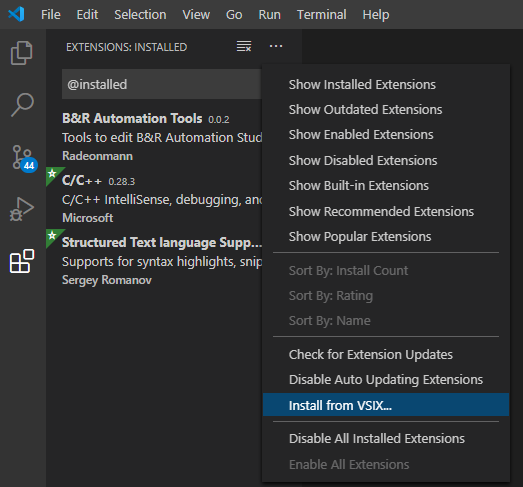
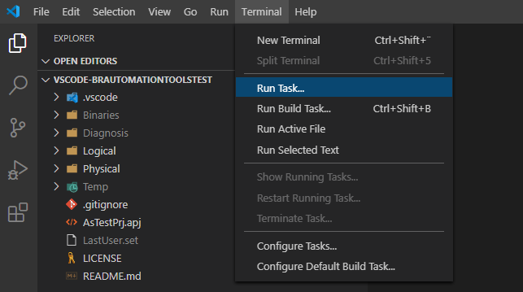
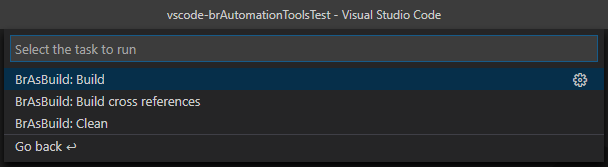
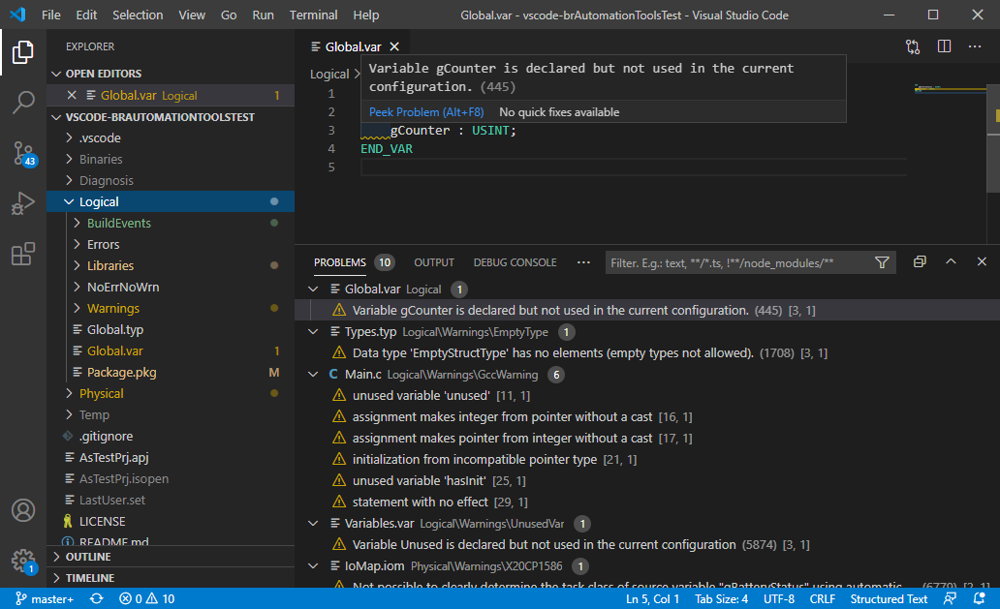
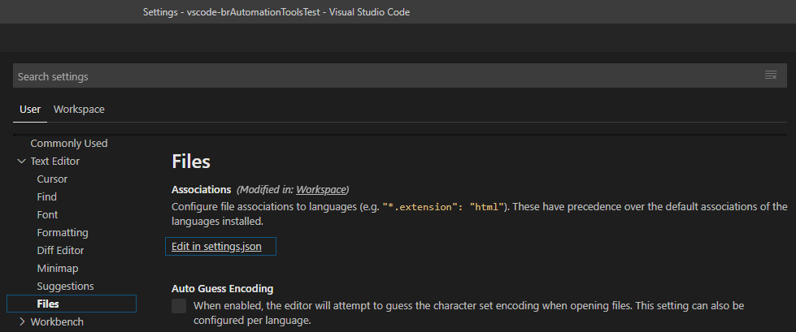

# B&R Automation Tools

B&R Automation Tools is an extension for [_Visual Studio Code_](https://code.visualstudio.com) to program and build B&R Automation Studio projects.

The B&R Automation Tools extension is NOT a product of [_B&R Industrial Automation GmbH_](https://www.br-automation.com), it is a privately written and inofficial experiment.

For most of the functionality a B&R Automation Studio needs to be installed on the develeoper PC currently.

## How to run the extension

### For non developers

1. Download a VSIX from one of the [_releases_](https://github.com/br-automation-com/vscode-brAutomationTools/releases)
2. [_Install the extension from the VSIX file_](https://code.visualstudio.com/docs/editor/extension-gallery#_install-from-a-vsix)
   
   

   > Do not double click the VSIX file, as it will try to install the extension to the full Visual Studio IDE.

If you don't want to test the extension in your productive VS Code environment, consider to have a separate [_portable VS Code instance_](https://code.visualstudio.com/docs/editor/portable).

## Features

### Build B&R Automation Studio projects

> Build functionality is only available, if an Automation Studio installation with a version matching the project version was detected by the B&R Automation Tools extension. See [Detecting installed B&R Automation Studio versions](#detecting-installed-br-automation-studio-versions).

The B&R Automation Tools extension provides tasks which execute BR.AS.Build.exe. This makes it possible to build the project directly within VS Code. The tasks can be configured to for a normal build, a build for a simulation target, creating an RUC package, cleaning the configuration and building the cross reference.

You can start the tasks by executing the `Run Task...` command in the `Terminal` Menu. If you want to configure the task as a standard build task, you can also select `Run Build Task...`.



VS Code will then show a list with all possible task providers. Select `BrAsBuild` to get a list of all standard tasks for BR.AS.Build.exe.


The B&R Automation Tools extension will then provide a list of all standard tasks. Select one to directly execute it, or click the gear icon on the right side to configure it in your workspace.



Configured tasks will be added to the _tasks.json_ in the _.vscode_ folder at the root of your workspace. There you can configure further options for your tasks, like e.g. the used build mode. VS Code will provide auto completion and descriptions for all available options.

A configured _tasks.json_ file could look like this:

```json
{
    "version": "2.0.0",
    "tasks": [
        {
            "label": "Build AS project with dialogs",
            "type": "BrAsBuild",
            "group": {
                "kind": "build",
                "isDefault": true
            }
        },
        {
            "label": "Rebuild AS project with RUC package",
            "type": "BrAsBuild",
            "asBuildMode": "Rebuild",
            "buildRUCPackage": true,
            "group": "build"
        },
        {
            "label": "Clean AS project",
            "type": "BrAsBuild",
            "cleanTemporary": true,
            "cleanBinary": true,
            "cleanGenerated": true,
            "cleanDiagnosis": false
        },
        {
            "label": "Build cross references of AS project",
            "type": "BrAsBuild",
            "buildCrossReferences": true
        }
    ]
}
```

>Tip: You don't have to enter unused options. Some options will show a dialog on execution of the task if they are not set (e.g. the build mode).

Check out the [_VS Code documentation_](https://code.visualstudio.com/docs/editor/tasks) for further information about tasks.

### Show errors and warnings of Automation Studio build

The B&R Automation Tools extension shows the error and warning output of a build task. The errors and warnings will show up in the Problems window, in the workspace browser and in the editor of the file where the issue was detected.



### Auto completion for C/C++ programs and libraries

The B&R Automation Tools extension provides information to the [_C/C++ extension_](https://marketplace.visualstudio.com/items?itemName=ms-vscode.cpptools) specific to an Automation Studio project.

This enables to use IntelliSense within C/C++ programs and libraries of Automation Studio projects. IntelliSense is also provided for variables, types, functions and function blocks within IEC files (*.var, *.typ, *.fun).

Currently the extension uses the header files created during an Automation Studio build to provide this information. Therefore after adjusting any of the IEC files, you need to build your project to get proper IntelliSense. A build of the cross reference is sufficient to create the header files.

### Detecting installed B&R Automation Studio versions

B&R Automation Tools finds Automation Studio versions installed on the developer PC. The Information of the installed Automation Studio versions is used to provide Information for other features, such as build, code completion...

The directory in which the Automation Studio versions are searched must be configured with the setting `vscode-brautomationtools.environment.automationStudioInstallPaths`. The default value is ```["C:\BrAutomation"]```.

The setting needs to have the same value(s) as the install path selected during Automation Studio installation. No recursive search is done.

After changing the installation path setting, the installed versions can be refreshed via the _B&R Tools: Refresh installed AS version information_ (`vscode-brautomationtools.updateAvailableAutomationStudioVersions`) command from the [_Command Palette_](https://code.visualstudio.com/docs/getstarted/userinterface#_command-palette), or by refreshing VS Code.

#### Example

If Automation Studio V4.6.x and V4.7.x are installed in `C:\BrAutomation` the directory structure looks like this:

```
|- C:\BrAutomation
|   |- AS
|   |- AS46
|   |   |- AS
|   |   |- Bin-en
|   |   |- ...
|   |- AS47
|   |   |- AS
|   |   |- Bin-en
|   |   |- ...
|   |- ...
```

For this case the setting `vscode-brautomationtools.environment.automationStudioInstallPaths` needs to be set to ```["C:\BrAutomation"]```.


### Detecting B&R Automation Studio projects in the workspace folders

All Automation Studio projects within all workspace folders are detected by the B&R Automation Tools extension. This information is used to provide information for other features, such as build, code completion...

When adding or removing a folder to the workspace, the information is automatically updated by the extension.

## Settings

| Name                                                                | Description  |
|---------------------------------------------------------------------|--------------|
| `vscode-brautomationtools.build.defaultBuildMode`                   | Default build mode which will be pre-selected in build task dialogs. |
| `vscode-brautomationtools.environment.automationStudioInstallPaths` | Paths where the Automation Studio versions are installed. E.g. if Automation Studio V4.6.x is installed in C:\\BrAutomation\\AS46, the install path is C:\\BrAutomation. See [Detecting installed B&R Automation Studio versions](#detecting-installed-br-automation-studio-versions) |


## Requirements

The B&R Automation Tools extension requires the [_C/C++ extension_](https://marketplace.visualstudio.com/items?itemName=ms-vscode.cpptools) for auto completion. It will be automatically installed during installation of the B&R Automation Tools extension.

## Known Issues

### Auto completion for C/C++

Code completion for C/C++ programs and libraries does not consider the properties of configurations in the Configuration View. Therefore following Automation Studio configuration settings are not supported by the auto completion:
*  Defines used by `-D` compiler switches (e.g. `-D MY_DEFINE`)
*  Additional include directories

### Support for IEC languages

The B&R Automation Tools extension currently does not support auto completion or syntax highlighting for IEC language files. Some extensions for IEC languages are already existing and you can use them in combination with this extension.

One examples is the [_Structured Text language Support_](https://marketplace.visualstudio.com/items?itemName=Serhioromano.vscode-st) extension by Sergey Romanov. It provides syntax highlighting, code folding and snippets for IEC structured text syntax.

To use this syntax highlighting within B&R IEC files (.var, .typ, .fun, ...), you can add the file extensions to the `files.associations` setting in your local or global Settings.



The configured setting in `settings.json` could look like this:
```json
"files.associations": {
        "*.fun": "st",
        "*.var": "st",
        "*.typ": "st",
        "*.iom": "st",
        "*.vvm": "st",
        "*.per": "st"
    }
```
